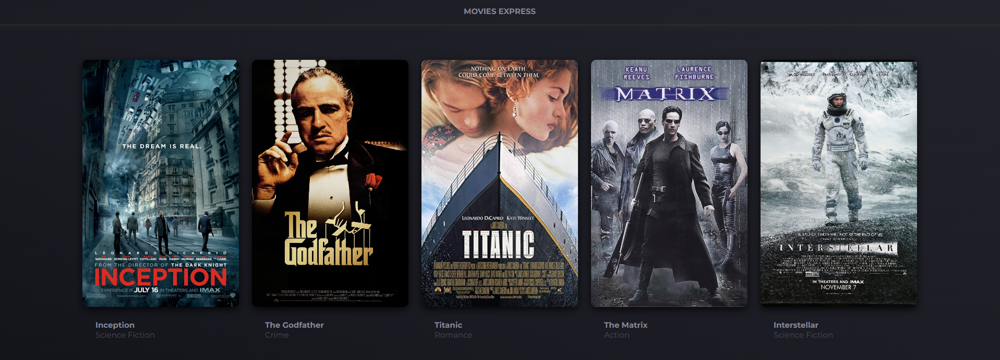
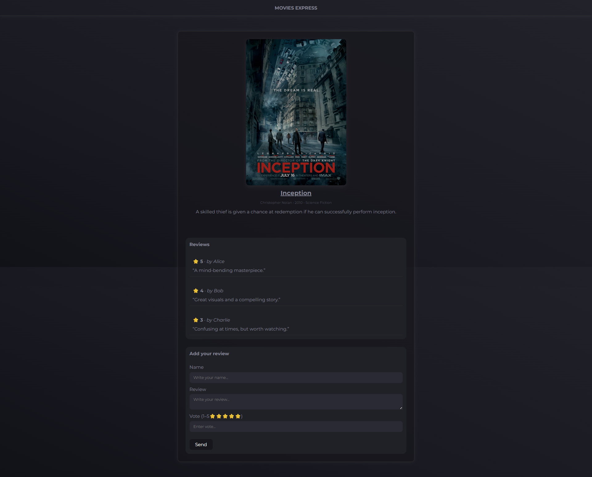

# webapp-express & webapp-react

## 🇬🇧 English Version

### Overview

Full-stack exercise focused on building a complete Web App: a backend in Express connected to MySQL and a React frontend consuming the API. The work involves routing, database operations, AJAX requests, forms, and global UI state management through Context.

### Assignment Summary

### Backend — Express (repo: webapp-express)

- Create a MySQL database using the provided SQL file.
- Create a new Express application and connect it to the database.
- Implement:
  - An **index** route returning the list of movies.
  - A **show** route returning movie details along with associated reviews.
- Configure **CORS** to allow API calls from the React app.
- Implement an API to **store a new review**, test it with Postman, and verify insertion in the database.

### Frontend — React (repo: webapp-react)

- Prepare an initial structure plan to maximize component reuse and props organization.
- Create a new React project with Vite, clean boilerplate, and install:
  - React Router
  - Axios
  - Bootstrap (optional)
- Create a base layout and define routes for:
  - Home page (movie list)
  - Single movie detail page
- Configure AJAX calls:
  - From the home page to retrieve the movie list.
  - From the detail page to retrieve details and reviews of a selected movie.
- Create a review form component and insert it in the movie detail page.  
  Submitting the form must:
  - Save the new review via the backend API.
  - Update the list of reviews displayed.
- Improve UX by adding:
  - A global **loader** component.
  - A **Loader Context** enabling any component to toggle the loader.

---

## 🇮🇹 Versione Italiana

### Panoramica

Esercizio full-stack dedicato alla costruzione di una Web App completa: un backend in Express collegato a MySQL e un frontend React che consuma le API. Il lavoro comprende routing, gestione del database, chiamate AJAX, form e gestione dello stato globale tramite Context.

### Riassunto della Consegna

### Backend — Express (repo: webapp-express)

- Creare un database MySQL importando il file SQL fornito.
- Creare una nuova applicazione Express e collegarla al database.
- Implementare:
  - Una rotta **index** che restituisce la lista dei film.
  - Una rotta **show** che restituisce i dettagli di un film e le sue recensioni.
- Configurare il middleware **CORS** per permettere le chiamate provenienti dall’app React.
- Predisporre un’API per **salvare una nuova recensione** legata a un film; testarla con Postman e verificare l’inserimento nel DB.

### Frontend — React (repo: webapp-react)

- Preparare una struttura logica dei componenti per favorire riusabilità e chiarezza delle props.
- Creare un nuovo progetto React con Vite, rimuovere il boilerplate e installare:
  - React Router
  - Axios
  - Bootstrap (opzionale)
- Creare un layout base e impostare le rotte per:
  - Home (lista dei film)
  - Pagina di dettaglio del film
- Effettuare chiamate AJAX:
  - Dalla home per ottenere la lista dei film.
  - Dalla pagina di dettaglio per ottenere informazioni e recensioni del film.
- Creare un componente form per le recensioni e inserirlo nella pagina di dettaglio.  
  All’invio del form:
  - Salvare la recensione nel database tramite l’API Express.
  - Aggiornare la lista delle recensioni mostrate.
- Migliorare l’esperienza utente:
  - Creando un componente **loader** visibile su qualsiasi pagina.
  - Implementando un **Context** per permettere ad ogni componente di attivare o disattivare il loader.
